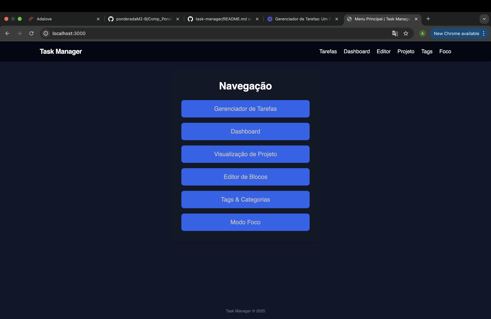
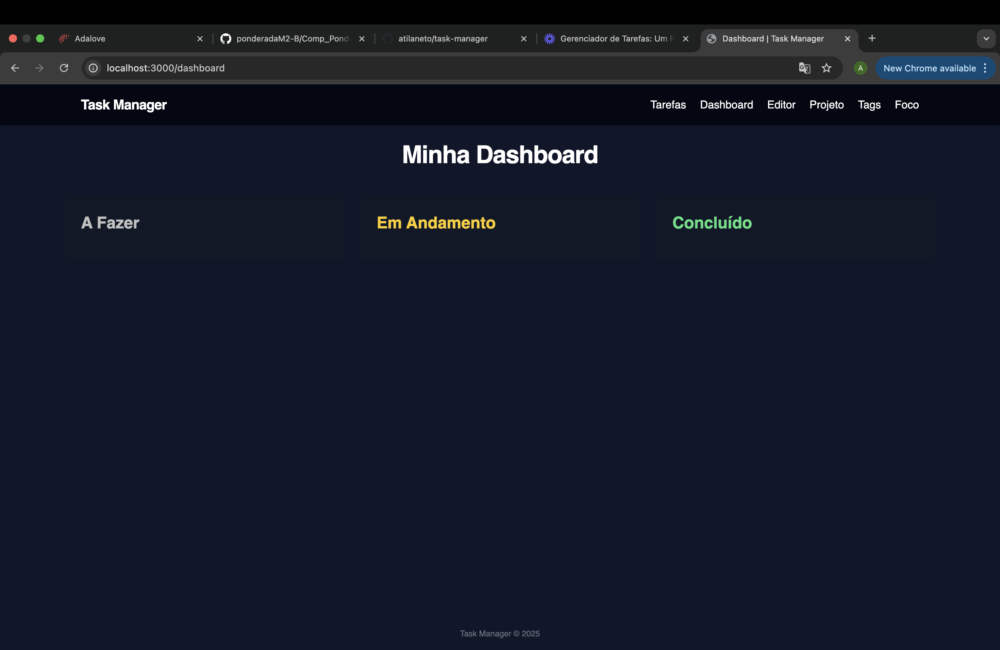
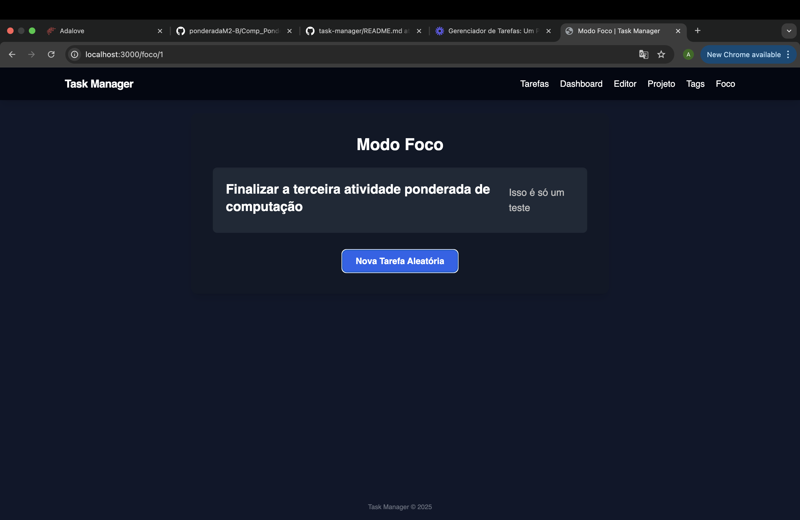

# Task Manager — Projeto Individual de Computação

Sistema web completo para gestão de tarefas pessoais, com interface moderna inspirada no Notion.

## Funcionalidades

- Cadastro, listagem e exclusão de tarefas
- Dashboard com colunas: A Fazer, Em Andamento, Concluído
- Modo Foco: exibe uma tarefa aleatória para concentração
- Filtros por categorias (tags)
- Editor de blocos com conteúdo livre
- Página de Projeto com visão geral das tarefas

---

## Tecnologias Utilizadas

- Node.js + Express
- PostgreSQL (via `pg`)
- EJS como engine de views
- Tailwind CSS para estilização
- Express-EJS-Layouts para layout base
- JavaScript (Fetch API) para consumo de rotas REST

---

## Como Executar Localmente

### Pré-requisitos
- Node.js instalado
- PostgreSQL instalado e configurado

### Passos

```bash
git clone https://github.com/atilaneto/task-manager.git
cd task-manager
npm install
````

Crie um arquivo `.env` com os seguintes dados:

```env
DB_NAME=tasks_manager
DB_USER=postgres
DB_PASSWORD=mac55-STAR
DB_HOST=localhost
DB_PORT=5432
DB_SSL=false
PORT=3000
```

Execute o servidor:

```bash
npm run dev
```

Acesse no navegador: [http://localhost:3000](http://localhost:3000)

---

## Imagens do Sistema

### Menu Principal



### Dashboard



### Modo Foco



---

## Vídeo de Demonstração

Link para o vídeo: [Acessar demonstração](https://www.loom.com/share/49a477f320b249a2aafd0ba330498337?sid=35706903-b8d4-4d93-9b3f-3c2b74373eae)

O vídeo apresenta o sistema funcionando localmente, com explicações sobre sua estrutura, funcionamento e decisões técnicas.

---

## Estrutura do Projeto

```
task-manager/
├── config/           # Conexão com o banco
├── controllers/      # Lógica das rotas da API
├── models/           # Consultas ao PostgreSQL
├── routes/
│   ├── index.js      # Rotas da API
│   └── frontRoutes.js
├── views/            # Views com layout base
│   ├── partials/     # head, header, footer
├── public/           # Arquivos públicos (se usados)
├── .env.example      # Exemplo de variáveis de ambiente
├── README.md
├── WAD.md
├── package.json
├── server.js
```

---

## Aprendizados e Desafios

Durante o desenvolvimento, enfrentei desafios importantes com o uso incorreto de layouts em EJS, o que gerava erros nas views. Resolvi isso padronizando o uso de `express-ejs-layouts` e removendo dependências desnecessárias como `layout('layout')`.

Também lidei com erros HTTP 500 causados por views ausentes ou variáveis indefinidas no render, e conflitos de versionamento no Git, que foram resolvidos com `pull --rebase` e `rebase --continue`.

A separação em MVC, o uso de layout base e o consumo da API com fetch foram pontos técnicos importantes que solidifiquei neste projeto.

---

## Autor

Átila Neto
Estudante de Ciência da Computação — Inteli
GitHub: [@atilaneto](https://github.com/atilaneto)

---

## Licença

Este projeto foi desenvolvido exclusivamente para fins acadêmicos como parte da disciplina de Computação — Módulo 2 do Instituto de Tecnologia e Liderança (Inteli).

O código está disponível apenas para fins educacionais e não deve ser utilizado em aplicações comerciais sem autorização prévia.

