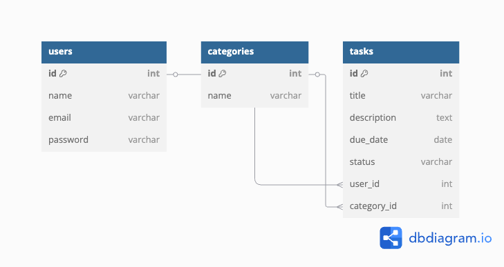

# Web Application Document — Projeto Individual — Módulo 2 — Inteli

## Task Manager

Átila Neto

---

## Sumário

1. [Introdução](#1-introdução-semana-02)  
2. [Visão Geral da Aplicação Web](#2-visão-geral-da-aplicação-web)  
3. [Projeto Técnico da Aplicação Web](#3-projeto-técnico-da-aplicação-web)  
4. [Desenvolvimento da Aplicação Web](#4-desenvolvimento-da-aplicação-web-semana-8)  
5. [Referências](#5-referências)
---

## 1. Introdução (Semana 02)

O **Task Manager** é uma aplicação web para gerenciamento de tarefas pessoais e profissionais, desenvolvida utilizando **Node.js** com **Express.js** e **PostgreSQL** como banco de dados relacional. A arquitetura do sistema segue o padrão **MVC (Model-View-Controller)**, permitindo uma separação clara entre a lógica de negócio, rotas e visualização, como requisitado pelo professor nesse projeto.

A proposta do projeto surgiu da necessidade de uma ferramenta mais enxuta e personalizada para a organização das minhas próprias demandas — tarefas da empresa, metas pessoais, compromissos com clientes, estudos da faculdade, estudos de violão, estudos de alemão, corridas/atividades físicas semanais e objetivos de longo prazo — como uma alternativa mais direta ao Notion, que embora poderoso, pode ser excessivamente complexo para tarefas simples.

---

## 2. Visão Geral da Aplicação Web

### 2.1 Personas (opcional)

Persona principal — "O Organizador Enxuto"
Nome: Abílio Neto
Idade: !() anos
Perfil: Estudante de Ciência da Computação e empreendedor iniciante (já com uma base de clientes e compromissos)
Objetivo: Quer administrar sua rotina de estudos, projetos da startup e reuniões com clientes sem depender de ferramentas complexas como o Notion
Motivações:

- Ter uma visão clara e objetiva do que precisa ser feito

- Usar uma ferramenta que não o distraia com funcionalidades desnecessárias

- Poder acessar e gerenciar suas tarefas com rapidez

Cenário de uso:
Abílio começa o dia planejando o que precisa fazer: preparar um pitch para um cliente, revisar um código de automação e estudar para uma prova. Ele acessa o Task Manager e rapidamente cadastra essas três tarefas, marcando uma como "Urgente", outra como "Estudo" e a última como "Cliente". Ao longo do dia, ele atualiza o status das tarefas e encerra o dia com uma visão clara de seu progresso.

2.2 User Stories
As user stories foram pensadas para refletir as necessidades reais de um usuário como Abílio, com foco em simplicidade, agilidade e organização.

Lista de User Stories:
US01: Como usuário, desejo criar uma tarefa para lembrar de realizar atividades futuras.

US02: Como usuário, desejo classificar tarefas por categorias para facilitar a organização.

US03: Como usuário, desejo marcar tarefas como concluídas para acompanhar meu progresso.

US04: Como usuário, desejo editar uma tarefa existente caso haja mudanças.

US05: Como usuário, desejo excluir tarefas que não são mais relevantes.

US06: Como usuário, desejo ver apenas as tarefas pendentes para focar no que ainda precisa ser feito.

US07: Como usuário, desejo filtrar tarefas por categoria para facilitar a visualização.

Detalhamento INVEST da User Story prioritária:
US01 — Criar nova tarefa

Independente: pode ser implementada sozinha

Negociável: a forma de entrada (formulário, input inline) pode variar

Valiosa: é o ponto de partida da aplicação — sem isso, não há conteúdo útil

Estimável: pode ser implementada em poucas horas

Pequena: possui escopo restrito (criar título, descrição, categoria, prazo)

Testável: pode ser validada por testes funcionais ou manuais (verificar se tarefa aparece na listagem após criação)


---

## 3. Projeto Técnico da Aplicação Web

### 3.1 Modelagem do banco de dados

O banco de dados foi modelado para representar de forma clara as entidades principais do sistema: usuários, tarefas e categorias. Cada tarefa pertence a um usuário e pode estar associada a uma categoria.

- Modelo relacional (diagrama):  


- Modelo físico em SQL:  
  [`docs/modelo-banco.sql`](docs/task-manager-diagram.sql)

#### Resumo da estrutura:

- `users`: armazena informações dos usuários (nome, email, senha)
- `tasks`: representa as tarefas cadastradas, com status e prazo
- `categories`: define categorias de tarefas

#### Relações:

- Um usuário pode ter várias tarefas
- Cada tarefa pode ter uma categoria
- Uma categoria pode ser usada por várias tarefas

### 3.1.1 BD e Models (Semana 5)

Os models foram definidos na pasta `models/` com base nas tabelas descritas acima. A conexão com o banco é feita via `pg` utilizando variáveis de ambiente definidas no arquivo `.env`.

### 3.2 Arquitetura (Semana 5)

O sistema segue o padrão **MVC**:

- **Model:** lida com a lógica de dados e persistência no banco
- **View:** renderiza as interfaces com EJS
- **Controller:** trata as requisições, executa a lógica de negócio e chama os models

Fluxo:  
**Usuário envia requisição → Controller processa → Model consulta banco → Controller responde com View (EJS)**

### 3.3 Wireframes (opcional)

Wireframes simples foram utilizados durante o planejamento para organizar visualmente o fluxo da aplicação.

### 3.4 Guia de estilos (opcional)

Não se aplica — estilos estão em desenvolvimento com CSS básico na pasta `styles/`.

### 3.5 Protótipo de alta fidelidade (opcional)

Não aplicável neste momento.

### 3.6 WebAPI e endpoints (Semana 5)

Exemplos:

- `GET /tasks` — lista tarefas
- `POST /tasks` — cria nova tarefa
- `DELETE /tasks/:id` — exclui tarefa
- `GET /users` — lista usuários
- `POST /users` — cria novo usuário

Documentação detalhada será incluída na próxima fase.

### 3.7 Interface e Navegação (Semana 7)

A navegação se baseia em páginas EJS simples e funcionais. As páginas estão localizadas na pasta `views/` e incluem páginas de listagem, criação e erro (`404.ejs`).

---

## 4. Desenvolvimento da Aplicação Web (Semana 8)

### 4.1 Demonstração do Sistema Web

*Vídeo a ser adicionado com a demonstração do sistema funcionando.*

- O sistema pode ser iniciado com:
  ```bash
  npm start
